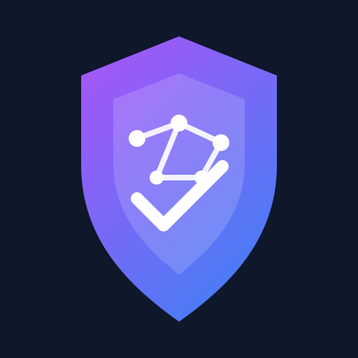
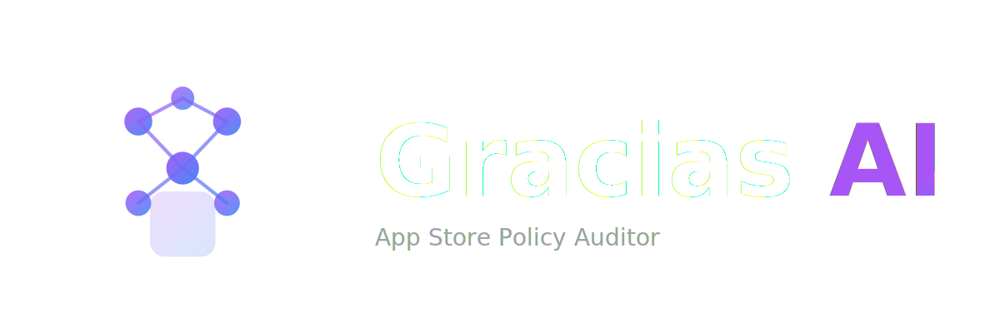

# Gracias AI Logo Design

This directory contains the logo design for Gracias AI App Store Auditor, submitted for bounty issue #2.

## Design Concept

The logo combines four key elements representing the product's core values:

1. **AI / Intelligence** - Neural network pattern and circuit nodes
2. **iOS / App Store** - Apple leaf silhouette
3. **Security / Compliance** - Shield shape and checkmark
4. **Trust / Transparency** - Clean, modern design with brand colors

## Files Included

- `logomark.svg` - Icon only (light background)
- `logomark-dark.svg` - Icon only (dark background)
- `wordmark.svg` - Icon + "Gracias AI App Store Auditor" text (light background)
- `wordmark-dark.svg` - Icon + text (dark background)

## Color Palette

| Color | Hex | Usage |
|-------|-----|-------|
| Purple | `#a855f7` | Primary brand color (shield gradient) |
| Blue | `#3b82f6` | Secondary color (circuit nodes, leaf) |
| White | `#ffffff` | Text and highlights on dark backgrounds |
| Dark Gray | `#1f2937` | Dark background variant |

## Usage Guidelines

- Use `logomark` for app icons, favicons, and small spaces
- Use `wordmark` for headers, marketing materials, and documentation
- Light variants are for white/light backgrounds
- Dark variants are for dark backgrounds

## Design Elements

1. **Shield Base** - Represents security and protection
2. **Neural Network Pattern** - Symbolizes AI intelligence
3. **Apple Leaf** - Represents iOS/Apple ecosystem
4. **Checkmark** - Indicates compliance and approval
5. **Circuit Nodes** - Symbolizes technology and connections

## Technical Details

- All files are in SVG format (vector)
- Responsive and scalable without quality loss
- Optimized for web and print use
- Follows Apple Design guidelines for modern aesthetics

## Preview

### Logomark (Light)

### Wordmark (Light)

### Logomark (Dark)

### Wordmark (Dark)

## License

This logo design is submitted under the terms of the bounty and becomes property of Gracias AI upon acceptance and payment of the bounty reward.